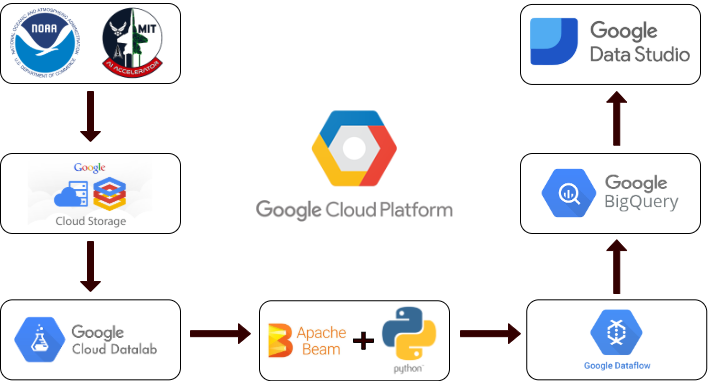

## SEVIR Data Pipelining Using Google Cloud Platform

We have implemented a data pipeline using different GCP components, Google Cloud Storage, Datalab, Apache Beam, Dataflow, Google Bigquery and Google Data Studio. The following is the data architecture for implementing a pipeline on Google Cloud Platform:





## Requirements

1. Create a new Project, Bucket on your GCP Account.
2. Enable the `BigQuery`, `AI Platform`, `Cloud Source Repositories`, `Dataflow`, and `Datalab APIs`
3. Using Cloud Shell:
    * Project Configuration on Cloud Shell: `gcloud config set project <PROJECT_ID>`
    * Creating Datalab: `datalab create --zone <ZONE_NAME> <DATALAB_NAME>`
4. Launch Datalab `http://localhost:8081/`
5. 
```
#### Cloning Datalab Notebook
In Datalab, create a new notebook by clicking the +Notebook icon in the upper left. The notebook opens in a new tab.
Copy and paste the following command in the first cell of the new notebook. 
```
!git clone https://github.com/GoogleCloudPlatform/training-data-analyst
```
In Datalab, open the notebook training-data-analyst/blogs/babyweight/babyweight.ipynb.

#### Perform preprocessing and Visualization

#### Project ID and Bucket setup in notebook
1. In the first cell, set the variable PROJECT to your project ID.
```
BUCKET = 'sunlit-adviser-303301-ml'
PROJECT = 'sunlit-adviser-303301'
REGION = 'us-central1'
```
2. Set the variable BUCKET to your bucket name in the first cell. For your bucket name, use your project ID as a prefix and my-bucket:
 project-ID-my-bucket
3. Leave REGION as us-central1.

#### Lesson Learned
1. Learned to set up a project in Google Cloud and instantiate DataLab from Cloud shell editor using shell commands.
2. Data exploration in Datalab and writing BigQuery to load data in dataframe and visualization.
3. Preprocessing of data using Dataflow


